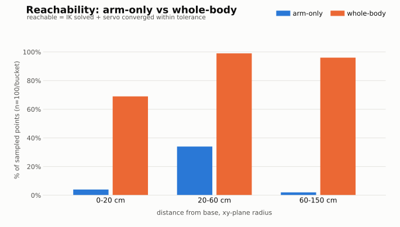

## Setup and run docker

```
git submodule update --init --recursive
chmod +x run.sh start_mm_tmux.sh
rerun --web-viewer
./run.sh
```
## Run in docker 
```
./start_mm_tmux.sh
```
or manually run
```
# 1. piper startup
bash find_all_can_port.sh
bash can_activate.sh can_piper 1000000 "1-4.2:1.0"
ros2 launch piper start_single_piper.launch.py

# 2. camera startup
ros2 launch piper d435i_high_resolution.launch.py

# 3. action server startup
set -a
source .env
ros2 run mm_actions mm_actions_node
```

## Whole-body mode (base + arm servo)

Controlled by the ROS 2 parameter `whole_body` (default: `false`, i.e.
arm-only). By default `mm_actions_node` only servos the Piper arm to reach a
target point. Set the parameter to also let it drive the Kachaka base while
servoing:

```
ros2 run mm_actions mm_actions_node --ros-args -p whole_body:=true
```

`start_mm_tmux.sh` passes this through as the `WHOLE_BODY` env var
(`WHOLE_BODY=true ./start_mm_tmux.sh`); it defaults to `false` so a plain
`./start_mm_tmux.sh` stays arm-only.

Whole-body mode requires:
- the `odom` -> `base_footprint` transform to be published (used to track
  how far the base has moved while servoing)
- `/kachaka/manual_control/cmd_vel` to be available for the base velocity
  commands

If either is missing, actions using whole-body mode will fail with
"no base pose available" / "no base command publisher available" instead of
falling back to arm-only.

## Force grasping mode

Controlled by the ROS 2 parameter `use_force_grasp` (default: `true`). When
on, `grasp` closes the gripper incrementally and uses force/voltage feedback
to detect a tight grip, then does a final tightness check and fails the
grasp if the object isn't actually held. When off, it just closes the
gripper to a fixed width with no force feedback.

```
ros2 run mm_actions mm_actions_node --ros-args -p use_force_grasp:=false
```

## Testing

```
docker exec mm_container python3 /workspace/main_ws/src/mm_actions/test/test_arm_only_point_servo.py
docker exec mm_container python3 /workspace/main_ws/src/mm_actions/test/test_whole_body_point_servo.py
```

### Reachability experiment: arm-only vs whole-body

Rerun (`--seed` picks a different random sample of points; defaults to `12345`):
```
docker exec mm_container python3 /workspace/main_ws/src/mm_actions/test/reachability_experiment.py --n-per-bucket 100 --seed 12345
```

Setup: 300 random points in the Piper base frame (100 per distance bucket:
near 0-20cm, mid 20-60cm, far 60-150cm; height z uniform 0-30cm, angle
random over the full circle), same points tested in both modes. Chart below
shows final reachability (IK solved + servo converged within tolerance);
the table breaks that down into the two steps.

Latest result (n=100/bucket):



| bucket | mode | IK-reachable | servo-success |
|---|---|---|---|
| near 0-20cm | arm-only | 4% | 4% |
| near 0-20cm | whole-body | 69% | 69% |
| mid 20-60cm | arm-only | 36% | 34% |
| mid 20-60cm | whole-body | 99% | 99% |
| far 60-150cm | arm-only | 2% | 2% |
| far 60-150cm | whole-body | 96% | 96% |
| **all (n=300)** | **arm-only** | **14.0%** | **13.3%** |
| **all (n=300)** | **whole-body** | **88.0%** | **88.0%** |

## Helpers
```
# set robot joint position to all 0s (home pose)

ros2 topic pub --once /joint_states sensor_msgs/msg/JointState "{name: ['joint1','joint2','joint3','joint4','joint5','joint6','gripper'], position: [0.0,0.2,-0.6,0.0,0.8,0.0,0.1]}"

# reset piper (used after pressing green button)
ros2 service call /reset_srv std_srvs/srv/Trigger

# send action: grasp the medicine can
ros2 action send_goal /task_command mm_interface/action/TaskCommand "{command: 'grasp the medicine can'}"

```
